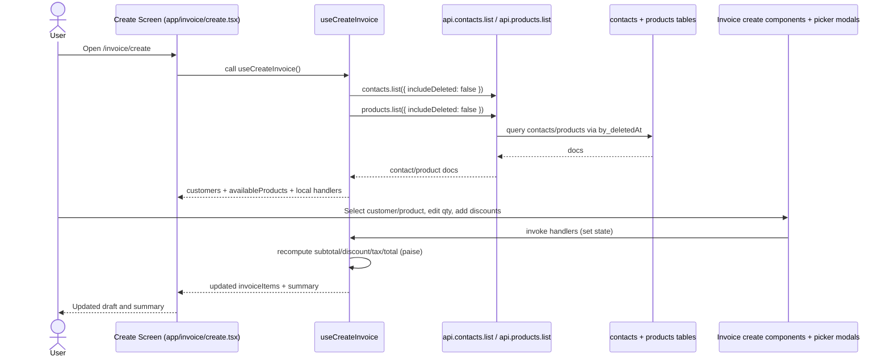
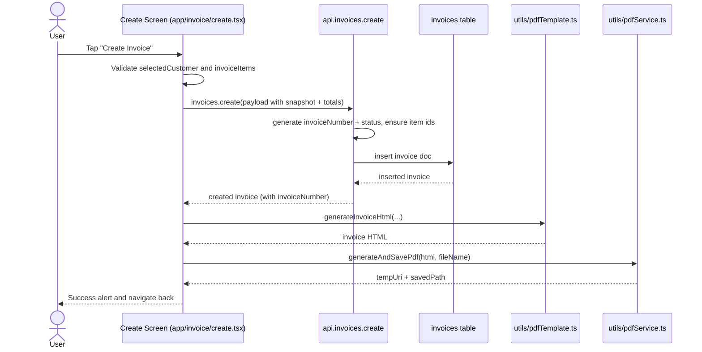

# Invoices Vertical Slice Walkthrough

## Scope and route surface
- Create route: `app/invoice/create.tsx`
- Detail/preview route: `app/invoice/[id].tsx`

This walkthrough starts at `app/invoice/*` as requested. At the end, there is a short "adjacent context" note for invoice list/search/share (`app/(tabs)/invoice.tsx`) because it uses the same domain model but is outside this slice.

## Sequence diagram narrative

### 1) Build an invoice draft (customer + items + summary)



Narrative:
- `useCreateInvoice` is the state owner for the draft invoice (`invoiceItems`, `selectedCustomer`, `globalDiscount`, modal state).
- Customer and product pickers are query-backed lists; search inside pickers is local/debounced via `useSearch`.
- `summary` is derived in-hook on every state change using paise + basis points (`utils/invoiceUtils.ts`, `utils/currency.ts`).

### 2) Persist invoice + generate PDF



Narrative:
- Invoice number is server-generated in `convex/invoices.ts` (`generateInvoiceNumber`), not client-generated.
- Invoice stores denormalized customer snapshot (`customerName`, `customerPhone`, etc.) plus embedded line items.
- PDF is generated locally on device and saved to app document storage; Convex does not store local file paths.

### 3) Open invoice preview + update payment/share/archive

```mermaid
sequenceDiagram
    actor User
    participant UI as Preview Route (app/invoice/[id].tsx)
    participant ConvexQ as api.invoices.get
    participant ConvexM as api.invoices.updatePayment / remove
    participant DB as invoices table
    participant Modal as PaymentModal
    participant PDF as pdfTemplate + pdfService

    User->>UI: Open /invoice/:id
    UI->>ConvexQ: invoices.get({ id })
    ConvexQ->>DB: fetch invoice
    DB-->>ConvexQ: invoice doc or null
    ConvexQ-->>UI: invoice
    UI-->>User: Loading / error / InvoicePreviewCard

    User->>Modal: Record payment and save
    Modal->>UI: onSave(amountInPaise)
    UI->>ConvexM: invoices.updatePayment({ id, amountPaid })
    ConvexM->>DB: patch amountPaid + recomputed status
    ConvexM-->>UI: { success, newStatus }
    UI-->>User: Success alert; reactive query refreshes displayed state

    User->>UI: Share invoice
    UI->>PDF: generateInvoiceHtml(invoice) + generatePdf + sharePdf
    UI-->>User: Native share sheet

    User->>UI: Archive invoice
    UI->>ConvexM: invoices.remove({ id })
    ConvexM->>DB: soft delete (set deletedAt)
    ConvexM-->>UI: { success: true }
    UI-->>User: Navigate back
```

Narrative:
- `InvoicePreviewCard` renders directly from fetched `InvoiceWithItems` with formatting helpers from `utils/currency.ts`.
- Payment status truth (`unpaid`/`partial`/`paid`) is backend-calculated (`calculateStatus`) when payment updates.
- Share path is local HTML/PDF generation from current fetched invoice document.

## Canonical types used in this slice
- `Doc<"invoices">` (`types/invoice.ts` as `InvoiceDoc`): canonical persisted invoice shape.
- `InvoiceWithItems` (`types/invoice.ts`): alias of `InvoiceDoc`, used by preview/share flows.
- `InvoiceId`, `ContactId`, `ProductId` (`types/invoice.ts`): typed Convex IDs.
- `InvoiceProduct` (`types/invoice.ts`): client-side line item model used in create flow and template rendering.
- `InvoiceSummary` (`types/invoice.ts`): derived money totals (`subtotal`, `totalDiscount`, `tax`, `total`) in paise.
- `Discount` + `DiscountType` (`types/invoice.ts`): discount contract (`flat` paise or `percent` basis points).
- `Customer` (`types/invoice.ts`): create-screen customer projection from contacts query.
- `Product` / `ProductUI` (`types/product.ts`): product doc/UI shape; mapped to `InvoiceProduct` in `useCreateInvoice`.
- `InvoiceStatus` + `isInvoiceStatus` (`types/invoice.ts`): status contract and guard used by list-oriented hooks.

## Source of truth map for displayed data

| Displayed data | Source of truth | How it reaches UI |
|---|---|---|
| Customer picker list | `contacts` table (`convex/schema.ts`) | `api.contacts.list` -> `useCreateInvoice` -> `ContactPickerModal` |
| Product picker list | `products` table (`convex/schema.ts`) | `api.products.list` -> `useCreateInvoice` -> `ProductPickerModal` |
| Selected customer in create screen | Local route state in `useCreateInvoice` | `handleContactSelect` stores selected `Customer` |
| Selected invoice items/quantities | Local route state in `useCreateInvoice` | `handleProductSelect`, `handleQuantityChange`, `handleRemoveProduct` |
| Per-item discount label in cards | Local `invoiceItems[].discount` | Set via `DiscountModal` -> `handleApplyDiscount` |
| Create-screen summary (subtotal/discount/tax/total) | Derived in `useCreateInvoice` from local draft state | Recomputed every render using `calculateDiscountAmount` + tax rule |
| Persisted invoice number | Backend in `convex/invoices.ts` | `invoices.create` returns inserted doc with `invoiceNumber` |
| Preview card data (customer snapshot, items, totals, date) | `invoices` table row | `api.invoices.get` in `app/invoice/[id].tsx` -> `InvoicePreviewCard` |
| Payment modal remaining/full-payment math | Local modal input + persisted `invoice.total` | `PaymentModal` derives on input change |
| Paid amount and status badge semantics | Backend patch in `invoices.updatePayment` | mutation response + reactive query update |
| Archived visibility of invoice | `deletedAt` soft-delete field in `invoices` table | `invoices.remove` sets `deletedAt`; list queries decide inclusion |
| Shared/generated PDF content | Current invoice data + local HTML template | `generateInvoiceHtml` + `PdfService.generatePdf/sharePdf` |

## Key files in recommended reading order
1. `app/invoice/create.tsx`
2. `hooks/useCreateInvoice.ts`
3. `components/invoice/InvoiceCreateCustomerSelection.tsx`
4. `components/invoice/ContactPickerModal.tsx`
5. `components/common/BaseSelectionModal.tsx`
6. `components/invoice/InvoiceProductsSection.tsx`
7. `components/invoice/InvoiceProductCard.tsx`
8. `components/invoice/ProductPickerModal.tsx`
9. `components/invoice/DiscountModal.tsx`
10. `components/invoice/InvoiceCreateSummary.tsx`
11. `app/invoice/[id].tsx`
12. `components/invoice/InvoicePreviewCard.tsx`
13. `components/invoice/PaymentModal.tsx`
14. `utils/invoiceUtils.ts`
15. `utils/currency.ts`
16. `convex/invoices.ts`
17. `convex/schema.ts`
18. `types/invoice.ts`
19. `utils/pdfTemplate.ts`
20. `utils/pdfService.ts`
21. `convex/contacts.ts`
22. `convex/products.ts`

## Adjacent context (outside `app/invoice/*` scope)
- Invoice list/search/selection/share entrypoint lives in `app/(tabs)/invoice.tsx`.
- That path primarily uses `hooks/useInvoices.ts`, `hooks/useInvoiceShare.ts`, and `components/invoice/InvoiceList.tsx`.
