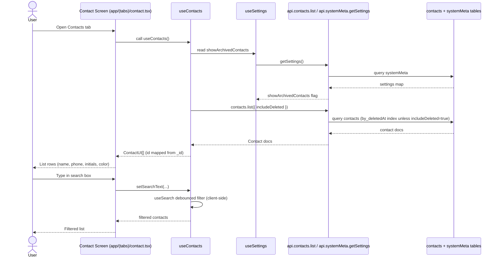
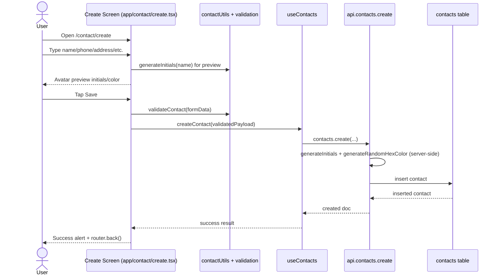
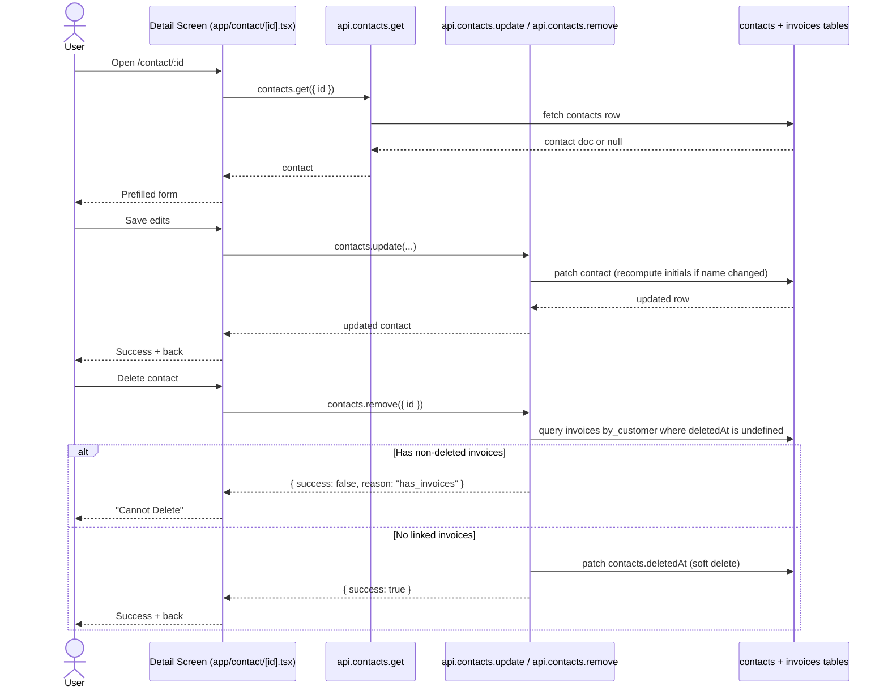

# Contacts Vertical Slice Walkthrough

## Scope and route surface
- Main entry screen: `app/(tabs)/contact.tsx`
- Create flow route: `app/contact/create.tsx`
- Detail/edit/delete route: `app/contact/[id].tsx`

Even though this walkthrough centers on `app/contact/*`, the list screen in `app/(tabs)/contact.tsx` is the user-facing entry point into the contacts slice.

## Sequence diagram narrative

### 1) Browse + search contacts

Narrative:
- The screen gets data through `useContacts`, which pulls two sources: contacts (`api.contacts.list`) and archived-toggle setting (`api.systemMeta.getSettings` via `useSettings`).
- Search is local, debounced filtering in `useSearch`; it does not call `api.contacts.search`.
- Row tap shows an alert with that row’s fields; edit tap routes to `/contact/[id]`; FAB routes to `/contact/create`.

### 2) Create contact

Narrative:
- Form state is local in `create.tsx`; validation happens with `validateContact`.
- District picker uses static district data plus local `useSearch`.
- Authoritative persisted initials/color are generated on the server in `convex/contacts.ts` during `create`.
- Returning to the list reflects new data through reactive Convex queries.

### 3) View/edit/delete contact

Narrative:
- Detail route fetches data directly with `useQuery(api.contacts.get)`.
- Save and delete are direct mutations from the screen (not through `useContacts`).
- Delete is guarded by backend invoice linkage check before soft delete.

## Canonical types used in this slice
- `Doc<"contacts">` (from Convex generated model): database-level truth for a contact.
- `Contact` in `types/contact.ts`: alias of `Doc<"contacts">`.
- `ContactUI` in `types/contact.ts`: UI-friendly shape (`id` instead of `_id`).
- `Contact` re-export in `types/index.ts`: canonical UI contact type used by components/screens.
- `ContactId` / `Id<"contacts">`: typed Convex contact identifier.
- `ContactSchema` + `ContactInput` in `utils/validation.ts`: canonical client-side validation contract for create flow.
- `TamilNaduDistrict` in `utils/districtList.ts`: union type for district picker options.

## Source of truth map for displayed data

| Displayed data | Source of truth | How it reaches UI |
|---|---|---|
| Contact list rows (`name`, `phone`, `initials`, `color`) | `contacts` table (`convex/schema.ts`) | `api.contacts.list` -> `hooks/useContacts.ts` maps `_id` -> `id` -> `components/contact/ContactItem.tsx` |
| Archived visibility of contacts | `systemMeta` table key `showArchivedContacts` | `hooks/useSettings.ts` -> `hooks/useContacts.ts` passes `includeDeleted` |
| Search text | Local React state | `hooks/useSearch.ts` (`searchText`) |
| Search results shown in list | Derived client state from fetched contacts | `hooks/useSearch.ts` filters `ContactUI[]` in memory |
| Contact detail alert (from list tap) | Selected `ContactUI` row object | Built in `app/(tabs)/contact.tsx` from current row fields |
| Create form field values | Local state in `app/contact/create.tsx` | `formData` drives `FormField` values |
| Create avatar preview initials | Local derived value from typed name | `generateInitials` in `utils/contactUtils.ts` |
| Create avatar preview color | Local random/selected color in form state | `generateRandomColor` + `ColorPicker`; preview only |
| Persisted initials/color after create | Backend-generated values in `convex/contacts.ts` | `contacts.create` computes and stores authoritative values |
| Edit form initial values | `contacts` table row by id | `api.contacts.get` in `app/contact/[id].tsx` |
| Edit form live values | Local state in detail screen | `formData` in `app/contact/[id].tsx` |
| District picker options | Static constant list | `TAMIL_NADU_DISTRICTS` in `utils/districtList.ts` via `DistrictPickerModal` |
| Delete eligibility message | Backend check against `invoices` table | `contacts.remove` returns `reason: "has_invoices"` when blocked |

## Key files in recommended reading order
1. `app/(tabs)/contact.tsx` (entry experience: list/search/navigation actions)
2. `components/contact/ContactList.tsx` (list container + virtualization/loading behavior)
3. `components/contact/ContactItem.tsx` (actual row fields and edit/press behavior)
4. `hooks/useContacts.ts` (primary list data hook and mutation handles)
5. `hooks/useSearch.ts` (debounced client filtering behavior)
6. `hooks/useSettings.ts` (archived filter dependency for contacts query)
7. `app/contact/create.tsx` (create form lifecycle and submit path)
8. `components/contact/DistrictPickerModal.tsx` (district selection + local search)
9. `utils/contactUtils.ts` (initials and color helper logic)
10. `utils/validation.ts` (Contact schema and `validateContact`)
11. `app/contact/[id].tsx` (detail fetch/edit/delete lifecycle)
12. `components/contact/DeleteContactButton.tsx` (destructive action UI boundary)
13. `convex/schema.ts` (contacts table shape + indexes)
14. `convex/contacts.ts` (authoritative backend behavior for list/get/create/update/remove)
15. `utils/districtList.ts` (district canonical set used in form UX)

## Notes for maintainers
- `useContacts` currently performs client-side filtering and always reads `api.contacts.list`; backend `api.contacts.search` exists but is not used here.
- In create flow, color/initials shown in preview are not persisted as-is; server generates canonical values on create.
