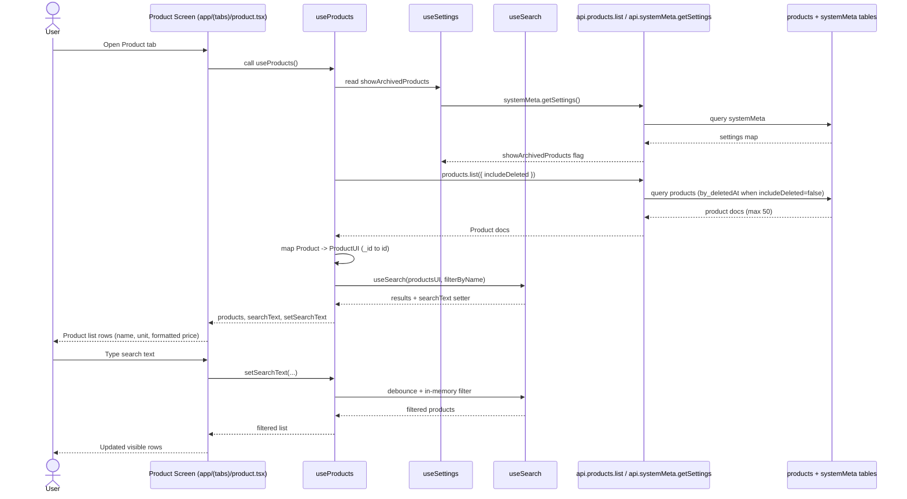
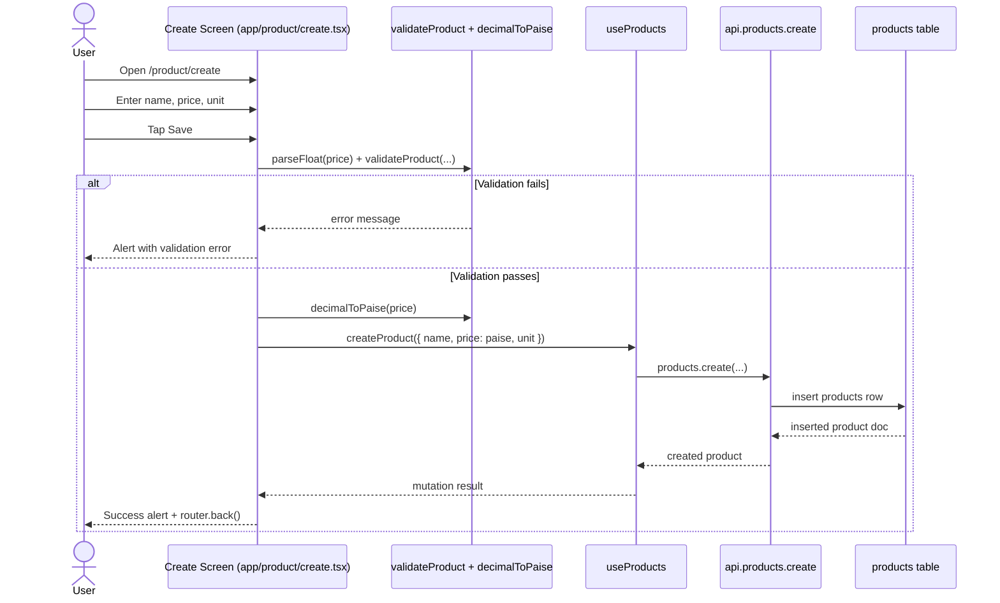
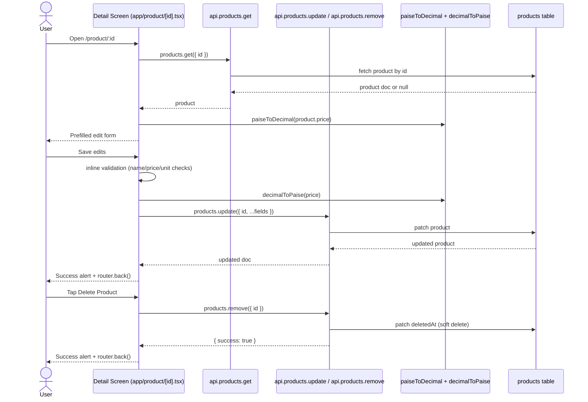

# Products Vertical Slice Walkthrough

## Scope and route surface
- Main entry screen: `app/(tabs)/product.tsx`
- Create flow route: `app/product/create.tsx`
- Detail/edit/delete route: `app/product/[id].tsx`

This walkthrough starts from `app/product/*` as requested, and includes `app/(tabs)/product.tsx` because that tab is where users enter the Products domain.

## Sequence diagram narrative

### 1) Browse + search products

Narrative:
- `app/(tabs)/product.tsx` renders header, search bar, list, and add button.
- `useProducts` drives product rows and search state.
- Archived behavior is controlled by `systemMeta.showArchivedProducts` via `useSettings`.
- Search is client-side (`useSearch`) over already-fetched products.

### 2) Create product

Narrative:
- Form state is local to `create.tsx`.
- Create flow uses shared product validation (`validateProduct`) and currency conversion (`decimalToPaise`).
- Persistence happens via `useProducts().createProduct`, which wraps `api.products.create`.

### 3) View/edit/delete product

Narrative:
- Detail screen reads by id with `useQuery(api.products.get)`.
- Update/delete are called directly with `useMutation` in the route (not through `useProducts`).
- Delete is soft delete (`deletedAt`), so archived visibility depends on settings.

## Canonical types used in this slice
- `Doc<"products">` from Convex generated model: database-level product document.
- `Product` in `types/product.ts`: alias of `Doc<"products">`.
- `ProductUI` in `types/product.ts`: UI shape with `id` instead of `_id`.
- `Product` re-export from `types/index.ts`: canonical UI product type used by routes/components (`ProductUI`).
- `ProductId` / `Id<"products">`: typed Convex product id for get/update/remove.
- `ProductSchema` and `ProductInput` in `utils/validation.ts`: canonical create-flow validation contract.

## Source of truth map for displayed data

| Displayed data | Source of truth | How it reaches UI |
|---|---|---|
| Product list rows (`name`, `unit`, `price`) | `products` table in `convex/schema.ts` | `api.products.list` -> `hooks/useProducts.ts` maps `_id` -> `id` -> `components/product/ProductItem.tsx` |
| Formatted price text (for rows and details alert) | Stored integer paise in `products.price` | `formatCurrency` in `utils/currency.ts` converts paise to `₹x.xx` display |
| Archived product visibility | `systemMeta` key `showArchivedProducts` | `hooks/useSettings.ts` -> `hooks/useProducts.ts` -> `products.list({ includeDeleted })` |
| Search input text | Local hook state | `hooks/useSearch.ts` (`searchText`, debounced) used inside `useProducts` |
| Visible filtered list | Derived client state | `hooks/useSearch.ts` filters `ProductUI[]` in memory by `name` |
| Create form values | Local route state | `formData` state in `app/product/create.tsx` |
| Create validation error messages | Zod product schema | `validateProduct` in `utils/validation.ts` |
| Edit form initial values | Product row fetched by id | `useQuery(api.products.get)` in `app/product/[id].tsx` |
| Edit form live values | Local route state | `formData` state in `app/product/[id].tsx` |
| Edit validation messages | Route-level inline checks | String checks in `app/product/[id].tsx` (`name`, `price`, `unit`) |
| Delete behavior | Soft-delete field in backend | `api.products.remove` patches `deletedAt` in `convex/products.ts` |

## Key files in recommended reading order
1. `app/product/create.tsx` (create lifecycle from input to mutation)
2. `app/product/[id].tsx` (fetch/edit/delete lifecycle by id)
3. `app/(tabs)/product.tsx` (list/search/navigation entry point)
4. `components/product/ProductList.tsx` (list container, loading, empty state)
5. `components/product/ProductItem.tsx` (row rendering and actions)
6. `components/product/ProductHeader.tsx` (domain header composition)
7. `components/product/ProductDeleteSection.tsx` (delete action UI boundary)
8. `hooks/useProducts.ts` (domain hook: fetch, map, search, mutations)
9. `hooks/useSearch.ts` (debounced local filtering primitive)
10. `hooks/useSettings.ts` (archived toggle source for list query)
11. `convex/products.ts` (authoritative list/get/create/update/remove behavior)
12. `convex/systemMeta.ts` (settings storage for archived toggles)
13. `convex/schema.ts` (products + systemMeta table and indexes)
14. `types/product.ts` (Product vs ProductUI contracts)
15. `types/index.ts` (UI-facing type re-export behavior)
16. `utils/validation.ts` (product validation schema)
17. `utils/currency.ts` (paise/rupee conversion and formatting)

## Notes for maintainers
- `useProducts` currently performs client-side search even though backend `api.products.search` exists.
- In `hooks/useProducts.ts`, `loading` is derived after `?? []`, so `loading` is effectively always `false` today.
- Create uses shared Zod validation (`validateProduct`), while edit uses route-local inline validation rules.
